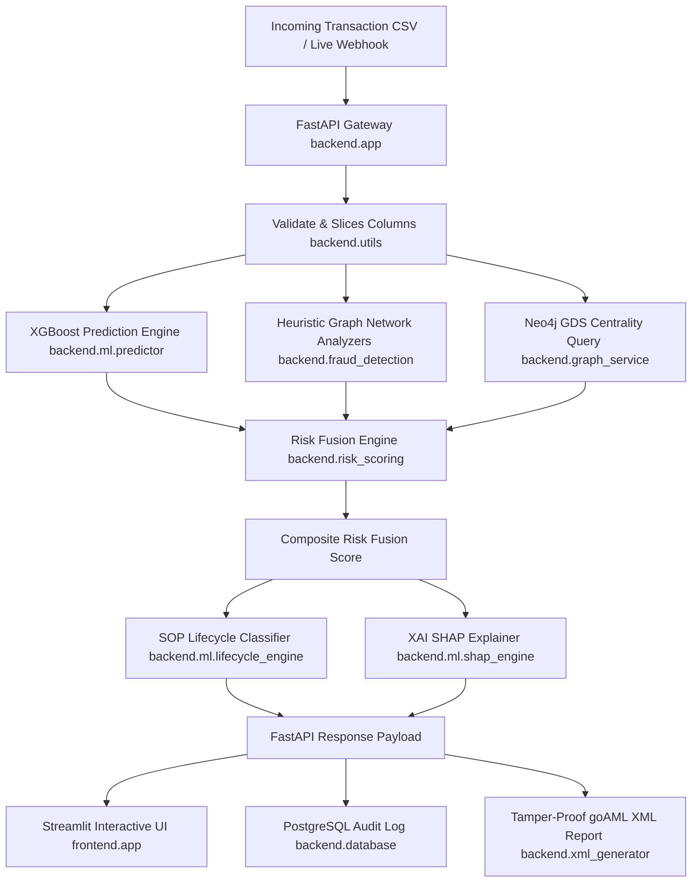

# 🛡️ MuleShield AI

> **Real-Time Mule Account Detection & Compliance Containment System**
> Transforming a 72-hour manual investigation into a 4-second automated containment decision. Powered by XGBoost, NetworkX/Neo4j graph centralities, and Gemini AI explainability — built with FastAPI + Streamlit.

---

## 1. The Problem: The 72-Hour Gap
India loses ₹1,776 crore annually to cyber fraud, with 66% passing through mule accounts. The critical issue is the **4–72 hour gap** between a victim filing a complaint (e.g., via I4C) and a bank investigator reviewing it. In this window, funds are dispersed. Current rule-based Transaction Monitoring Systems (TMS) fail to detect mule accounts because they evaluate transactions in isolation against static thresholds (e.g., >₹50,000), generating 95% false positives, while mule accounts often maintain compliant profiles and individual transaction limits.

## 2. The Solution: MuleShield AI
MuleShield is a 4-layer on-premise system designed to identify, trace, and suspend money laundering "mule" accounts in under 8 seconds. It enables banks to freeze funds within the critical 4-hour recovery window before dispersal, potentially saving millions while eliminating compliance bottlenecks.

**Key Value Propositions:**
- **AML Investigator:** Receives a risk-ranked queue of flagged accounts, explained via SHAP, reducing investigation time from 4 hours to 47 minutes.
- **Branch Risk Officer:** Gets clear freeze recommendations and escalation triggers.
- **Compliance CCO / FIU Reporting:** Benefits from 8-second automated goAML XML STR generation, eliminating backlogs.

---

## 3. System Architecture

MuleShield AI fuses state-of-the-art Tabular XGBoost prediction with Neo4j Graph Database topological centrality measurements and NetworkX heuristic analyzers. High-risk alerts automatically compile suspicious transaction reports (STR) conformant to FIU-IND goAML schemas, sealed with cryptographic signatures for legal evidence admissibility.



---

## 4. Core Features

### 🧠 Dual-Engine Fusion
Combines machine learning scores (XGBoost + SMOTE with 111:1 class imbalance handling) with topological graph network centralities (Neo4j GDS / NetworkX) to evaluate topological risk and detect mule hubs. `Composite Risk = (ML Probability × 0.40) + (Transaction Signal Score × 0.40) + (Graph Centrality × 0.20)`

### 🔄 Mule Lifecycle Staging
Maps accounts dynamically into 5 states: *Newly Recruited*, *Activation*, *Active Mule*, *Being Flushed*, and *Dormant*. This dictates investigator action (e.g., monitor vs. emergency freeze).

### 💡 Explainable AI (XAI)
Provides per-row SHAP attribution models to visualize exactly which features contributed to the alert, mapped to plain English (e.g., "Regulatory watchlist flag active (+23 pts)").

### 📑 Auto-goAML Autopilot
Instantly generates XML suspicious transaction reports compliant with international FIU standards. Reduces STR writing time from 8 hours to 8 seconds.

### 🔒 Cryptographic Tamper-Proofing
Seals evidence packages using SHA-256 hashes conformant to legal standards (e.g., Section 65B of the Indian Evidence Act) for court admissibility.

### 🔌 I4C Webhook Integration & Batch CSV
Native integration to ingest MHA I4C JSON payloads. Alternatively, handles high-throughput scoring of CBS exports (Finacle batch CSV), eliminating the need for costly Core Banking System (CBS) modifications.

### 🛡️ Resilient Offline Fallback
Gracefully falls back to ML-only if Neo4j fails, or SHAP text if LLM API fails. High availability for operational deployments.

---

## 5. Dataset Setup
MuleShield AI requires a Bank of India (BOI) transaction dataset for training and full inference pipelines.
* The full BOI dataset (`DataSet.csv`) is **not included** in this GitHub repository due to file size limits and data distribution constraints.
* Users must place their transaction dataset at:
  ```path
  data/boi/DataSet.csv
  ```
* For detailed instructions and directory structure information, please refer to the [data/README.md](file:///d:/Projects/FundTrace-AI/data/README.md).

---

## 6. Installation
MuleShield AI is designed for rapid one-command setup. Ensure Python 3.10+ is installed on your local host machine.

### Windows (PowerShell)
```powershell
./scripts/setup.ps1
```

### Windows Command Prompt (cmd.exe)
```cmd
powershell -ExecutionPolicy Bypass -File scripts\setup.ps1
```

### Linux / macOS (Bash)
```bash
chmod +x ./scripts/setup.sh
./scripts/setup.sh
```

---

## 7. Quick Start
Follow these steps to run the MuleShield AI application locally:

### Step 1: Start Services (Docker Compose)
Start the Docker database services:
```bash
docker compose up -d
```

### Step 2: Ingest Scenarios
Execute the dataset generator script once to generate Indian banking CSV transaction matrices:
```bash
python generate_synthetic_data.py
```

### Step 3: Start the Backend API
Run the FastAPI web server:
```cmd
venv\Scripts\python.exe -m uvicorn backend.app:app --reload --port 8000
```
* **Interactive Swagger Documentation** → [http://localhost:8000/docs](http://localhost:8000/docs)

### Step 4: Start the Frontend UI
Launch the Streamlit web dashboard in a separate terminal:
```cmd
venv\Scripts\streamlit.exe run frontend/app.py
```
* **Web UI Dashboard** → [http://localhost:8501](http://localhost:8501)

---

## 8. Environment Variables
MuleShield loads all configurations from `.env`. A complete configuration blueprint is defined in `.env.example`:

| Env Variable | Purpose | Default |
| :--- | :--- | :--- |
| `POSTGRES_HOST` | PostgreSQL Host address | `localhost` |
| `POSTGRES_PORT` | PostgreSQL database TCP port | `5432` |
| `POSTGRES_DB` | Target PostgreSQL database name | `muleshield` |
| `POSTGRES_USER` | PostgreSQL superuser username | `postgres` |
| `POSTGRES_PASSWORD` | PostgreSQL database password | `postgres` |
| `NEO4J_URI` | Neo4j Bolt URL connection string | `bolt://localhost:7687` |
| `NEO4J_USER` | Neo4j administrative username | `neo4j` |
| `NEO4J_PASSWORD` | Neo4j database password | `password` |
| `NVIDIA_API_KEY` | Optional NVIDIA NIM API key | *(Omitted)* |
| `GEMINI_API_KEY` | Google Gemini API key for explaining | *(Omitted)* |

---

## 9. Docker Setup
To standardise environment startup, MuleShield features a configured `docker-compose.yml` defining database infrastructure:

* **PostgreSQL:** Port `5432` (database: `muleshield`, user: `postgres`, password: `postgres`). Persisted in named volume `postgres-data`.
* **Neo4j:** Ports `7687` (Bolt protocol) and `7474` (HTTP graph dashboard browser). Username: `neo4j`, Password: `password`. Persisted in named volumes `neo4j-data` and `neo4j-logs`.

### Execution commands
```bash
# Start containers
docker compose up -d

# Stop and teardown containers
docker compose down -v
```

---

## 10. Local Development
### Run Code Audits
Verify syntax warnings and check for compliance words across the codebase:
```bash
python check_audit.py
```

### Run Health Checks
Run the diagnostic framework at any time to verify directories, ML weights, datasets, and database connections:
```bash
python health_check.py
```

### Run Test Suites
Verify inference logic, routing endpoints, graph heuristics, and database fallbacks:
```bash
python -m unittest discover -s tests
```

---

## 11. Troubleshooting

| Issue | Root Cause | Resolution |
| :--- | :--- | :--- |
| `Cannot connect to MuleShield API` | FastAPI backend is not running | Activate virtual environment and run the backend gateway starting command. |
| `Scenario CSV Files Not Found` | Dataset generator has not run | Execute `python generate_synthetic_data.py` to compile the standard scenarios. |
| `Streamlit ModuleNotFoundError` | Venv environment not active | Make sure to activate `venv` before executing streamlit commands. |
| `HEALTH CHECK WARNING on Database` | Databases are offline | This is expected if docker containers are not active. Application will automatically run in high-fidelity mock fallback mode. Run `docker compose up -d` to connect. |
| `PyVis network graph doesn't load` | Pyvis rendering error | Verify that graph components are running cleanly. If rendering fails, a clean warning banner will display without crashing the Streamlit session. |
