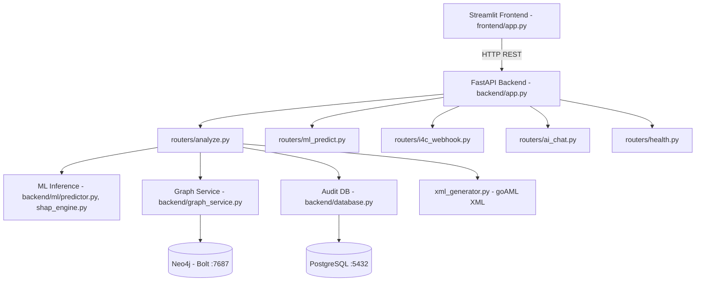
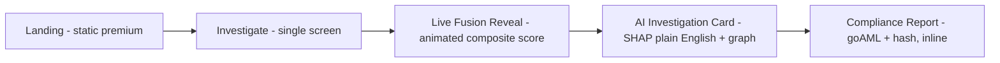

# BUILD_GUIDE.md — Architecture, Redesign Plan & 48-Hour Roadmap

> Tags: `[FACT]` from uploaded project docs · `[DECISION]` locked · `[RECOMMENDATION]` proposed, not yet built.

---

## 1. Current Architecture `[FACT]`



### Project Structure `[FACT]`
```
backend/
  app.py                # lifespan init, router registration
  routers/               # health.py, analyze.py, ai_chat.py, ml_predict.py, i4c_webhook.py
  ml/
    predictor.py         # XGBoost inference
    shap_engine.py        # SHAP TreeExplainer
    feature_lookup.py
    lifecycle_engine.py    # DORMANT→ACTIVATION→...→BEING_FLUSHED
    score_fusion.py        # 0.40/0.40/0.20 fusion weights
  graph_service.py         # Neo4j Bolt driver, degree centrality
  database.py               # PostgreSQL ORM, SHA-256 evidence hashing
  xml_generator.py           # goAML XML compliance reports
  ml_artifacts/                # final_model.pkl, imputer_full.pkl, final_metadata.json, cat_mappings.json
frontend/
  app.py                       # Streamlit dashboard
  components/                    # graph_view.py etc.
data/                              # fallback JSON, test scenarios
docker-compose.yml                  # postgres:16-alpine, neo4j:5.15-community
```

### API Contracts `[FACT]`
- `POST /analyze` — CSV upload → composite risk alerts + goAML XML + evidence hash
- `POST /predict/single` — single account feature lookup
- `POST /ingest-i4c` — simulated government threat-intel webhook

### Composite Risk Formula `[FACT]`
```
Composite Risk = (Profile Risk × 0.40) + (Transaction Risk × 0.40) + (Graph Risk × 0.20)
```
Severity tiers: CRITICAL ≥80 (AUTO_FREEZE), HIGH 60-79, MEDIUM 40-59, LOW <40 (all except LOW generate a goAML STR).

---

## 2. Known Constraints (Hard, Do Not Violate)

- `[CONSTRAINT]` Backend logic, scoring formula, and ML pipeline must NOT be touched — only re-audited for the leakage risk below.
- `[CONSTRAINT]` 2 days total remaining.
- `[CONSTRAINT]` True Stripe/Linear-parity UI is not achievable natively in Streamlit — plan splits work between a CSS-injected Streamlit re-skin (working app) and a separate static React/Tailwind landing page (first-impression demo asset).
- `[RISK — blocking]` VALIDATION_REPORT.md §4.4 reports ROC-AUC = 1.000000, PR-AUC = 1.000000 on a validation split with only 16 positive samples. This must be re-audited for residual leakage (beyond the already-excluded F3912) or reframed honestly before any pitch material is finalized. Do not present this number uncritically.

---

## 3. UI/UX Redesign Plan `[RECOMMENDATION]`

### Design Decision
`[DECISION]` Minimal Enterprise + Soft Glass, dark-mode-first. B2B compliance-tool aesthetic (Stripe/Linear/Mercury-inspired), single accent color reserved for interactive elements only. Full token spec in `DESIGN_SYSTEM.md`.

### User Flow (collapsed from prior multi-tab layout)

5 conceptual steps, 3 actual clicks. Previous "Summary" page merged into Compliance Report screen. Account Inspector + Alert Center merged into one Investigate screen.

### Component Hierarchy (target)
```
Landing (static)
└── App Shell (left rail: Overview / Investigate / Reports)
    ├── Overview: 4-card KPI strip + composite gauge
    ├── Investigate: upload → fusion reveal → SHAP card (same screen, no page jump)
    └── Reports: goAML XML card + evidence hash + graph explore (secondary tab)
```

---

## 4. Feature Specifications — Highest ROI (ranked, all <6h each)

| Rank | Feature | Impact | Effort | Notes |
|---|---|---|---|---|
| 1 | CSS/typography overhaul (Inter/Geist font, dark theme, spacing) | Very High | 2-3h | Cheapest perception lift |
| 2 | Animated composite score reveal | High | 3h | Turns static number into a moment |
| 3 | SHAP → plain-English card redesign | High | 2h | Data already exists, re-render only |
| 4 | Static React/Tailwind landing hero | High | 4-6h | First judge impression |
| 5 | Card-based KPI strip (4 max) | Medium-High | 2h | Replace scattered widgets |
| 6 | goAML reveal + hash animation | Medium-High | 2-3h | Dramatizes core differentiator |
| 7 | Graph viz restyle (PyVis colors/labels) | Medium | 2h | No backend change |
| 8 | Micro-interactions (hover/lift via CSS) | Medium | 1-2h | Cheap polish |
| 9 | Skeleton loading/empty states | Medium | 2h | Avoids "broken" look mid-demo |
| 10 | Risk heatmap mini-widget | Low-Medium | 3h | Cut first if time runs short |

---

## 5. Simplification Opportunities

`[RECOMMENDATION]`
- Merge Account Inspector + Alert Center → Investigate screen.
- Drop live Neo4j from the *default* demo path; keep as secondary "explore" tab with a cached/static fallback graph.
- Route all raw feature codes (F670, F886, …) through the existing plain-English mapping everywhere they appear, not just in SHAP.
- Collapse the dual severity/mule-stage taxonomies into one visual scale for judges; keep both in the backend/report only.
- Cut duplicate score visualizations — one fused number, one chart.

---

## 6. Technical Debt (do not fix now, just documented)

`[FACT/FLAG]`
- Validation metric leakage risk (§2 above) — must be addressed before pitch, not a UI task.
- Unresolved prior "overclaiming incident" — user-side resolution required, not a code task.
- `docker-compose.yml` uses plaintext `postgres/postgres` and `neo4j/password` credentials — fine for a hackathon demo, note if asked about production-readiness.

---

## 7. Impact vs Effort — Priority Matrix

| | Low Effort | High Effort |
|---|---|---|
| **High Impact** | Typography/theme overhaul, SHAP card redesign, KPI cards, score animation, goAML reveal | Static React landing page |
| **Low Impact** | Icon set swap, empty states | Live Neo4j demo hardening — **cut this**, use static fallback instead |

---

## 8. 48-Hour Implementation Roadmap

**Day 1 (0-24h)**
- 0-3h: CSS/typography/theme overhaul across Streamlit app
- 3-6h: Rebuild dashboard as 3-zone bento layout; merge Inspector+Alert Center
- 6-9h: SHAP plain-English card redesign + severity badge standardization
- 9-12h: Composite score animation + goAML reveal animation
- 12-16h: Static React/Tailwind landing page
- 16-20h: Graph viz restyle + cached fallback
- 20-24h: Integration pass, wire landing → app flow

**Day 2 (24-48h)**
- 24-30h: Full demo rehearsal, fix visual bugs found live
- 30-34h: Loading/empty states, micro-interactions polish
- 34-38h: PPT build from real app screenshots
- 38-42h: Resolve validation-metric framing + overclaiming-incident answer
- 42-46h: Full dry-run pitch with timing
- 46-48h: Buffer for last-minute breakage

---

## 9. Demo Flow

1. (10s) Static landing hero
2. (10s) "Run Live Investigation" → Investigate screen
3. (30s) Upload sample transaction batch, narrate processing
4. (30s) Composite score animates in, point out three fused inputs
5. (30s) SHAP plain-English card, read one bullet aloud
6. (20s) One click → goAML report + hash animation
7. (15s) Close on trust-footer framing ("pilot-ready for a bank")

Default path must run fully offline-capable — see §2 constraint.

---

## 10. PPT Flow

1. Hook (one line, same visual language as landing)
2. Problem (3 stat cards, same card component)
3. Solution + architecture diagram (simplified, business-language version — see §1 diagram, strip to conceptual boxes only)
4. Live demo (or screen recording as insurance)
5. Differentiator: SHAP + goAML compliance chain (its own slide)
6. Validation results — reframed honestly, not raw 1.0 AUC
7. Roadmap: bank pilot / RBI sandbox framing
8. Team + close
