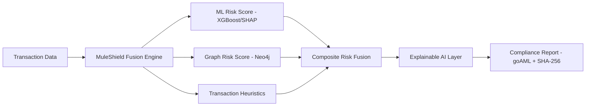

# PROJECT_CONTEXT.md — MuleShield AI (Single Source of Truth: Vision)

> **Tag legend used throughout this doc**: `[FACT]` verified from uploaded project docs · `[INFERENCE]` reasoned from evidence · `[RECOMMENDATION]` strategic suggestion, not yet built · `[DECISION]` locked design choice · `[IDEA]` future/optional, do not build yet.

---

## 1. What This Project Is

**MuleShield AI** — `[FACT]` a dual-engine (tabular ML + graph analytics) money-mule detection platform for banks, built for the PEC Hacks 4.0 hackathon (Aug 29–30, 2026, Panimalar Engineering College, Chennai).

`[RECOMMENDATION]` **Positioning**: "The compliance officer's autopilot" — infrastructure that catches mule accounts before funds are flushed *and* auto-generates a regulator-ready evidence package, not just a fraud-score demo.

`[RECOMMENDATION]` **Tagline**: "See the mule before the money moves."

---

## 2. Problem & Solution

**Problem** `[INFERENCE]`: India's UPI-scale digital payment rails are exploited via money-mule accounts (often recruited from financially vulnerable/unbanked-adjacent populations). Manual bank compliance review (STR filing) is slow, and most rules-based systems lack explainability or graph-level network awareness.

**Solution** `[FACT]`: A composite risk-fusion engine —
```
Composite Risk = (Profile Risk × 0.40) + (Transaction Risk × 0.40) + (Graph Risk × 0.20)
```
— combining an XGBoost classifier (tabular), heuristic transaction rule analyzers (cycles, layering, structuring, velocity, anomaly, dormant reactivation), and Neo4j graph degree centrality, with SHAP-based explainability and automated goAML-compliant XML report generation plus SHA-256 evidence hashing (Section 65B Indian Evidence Act framing).

---

## 3. Target Users

`[INFERENCE]` Primary: bank AML/compliance teams (investigators, STR filers). Secondary: hackathon judges evaluating as a FinTech-infrastructure pitch, not an end-consumer product. This is a **B2B compliance tool**, not a consumer app — UI and pitch language should reflect that (trust, auditability, precision — not consumer delight).

---

## 4. Differentiators

`[FACT]`/`[INFERENCE]` mix, ranked by defensibility:
1. **Compliance-grade output** — goAML XML + cryptographic evidence hash. Few student hackathon projects build the regulatory-output layer, only the ML layer.
2. **Dual-engine fusion** — graph + tabular, not single-model.
3. **Explainability** — SHAP mapped to plain-English risk signals (see `OPERATIONS.md`'s F670/F886/etc. dictionary).
4. **Lifecycle staging** — accounts move through DORMANT → ACTIVATION → NEWLY_RECRUITED → ACTIVE_MULE → BEING_FLUSHED, not a single static score.

---

## 5. Architecture Overview (see BUILD_GUIDE.md for full detail)



Stack `[FACT]`: FastAPI backend, Streamlit frontend, PostgreSQL (audit log), Neo4j (graph), XGBoost+SHAP (ML), Docker Compose (local infra).

---

## 6. UI Philosophy

`[DECISION]` Minimal Enterprise + Soft Glass, dark-mode-first, single accent color reserved for interactive elements, risk-tier colors standardized (Critical=red-600, High=amber-500, Medium=yellow-400, Low=emerald-500). B2B compliance-tool aesthetic (Stripe/Linear-inspired), not consumer-app aesthetic. Full detail in `DESIGN_SYSTEM.md`.

`[INFERENCE — constraint]` True Stripe/Linear-parity is not fully achievable in native Streamlit within a 2-day window. Plan: heavy CSS-injected re-skin of Streamlit for the working app + a separate static React/Tailwind landing page used for the demo's first impression. See `BUILD_GUIDE.md` §"Known Constraints."

---

## 7. AI Philosophy

`[DECISION]` No new ML models added for the hackathon deadline. All "AI investigation" output is a **re-presentation** of existing SHAP + risk fusion + lifecycle data as a plain-English narrative — not new inference.

---

## 8. Business Model

`[RECOMMENDATION — not built, pitch narrative only]` B2B SaaS / on-premise licensing to banks, positioned for air-gapped deployment (already supported per `OPERATIONS.md` §5.1). Revenue model: not implemented, mention only as roadmap framing in pitch, don't overclaim traction.

---

## 9. Roadmap (post-hackathon, `[IDEA]` tier — do not build now)

- RBI regulatory sandbox pilot
- Multi-bank deployment with tenant isolation
- Expanded feature set beyond 122 validated variables
- Real-time streaming ingestion (currently batch CSV via `/analyze`)

---

## 10. Implementation Status (as of last audit)

| Component | Status | Source |
|---|---|---|
| FastAPI backend + routers | `[FACT]` Built | ARCHITECTURE.md, VALIDATION_REPORT.md |
| XGBoost + SHAP pipeline | `[FACT]` Built | ARCHITECTURE.md §4 |
| Neo4j graph scoring | `[FACT]` Built, degrades gracefully offline | ARCHITECTURE.md §5, RELEASE_READINESS.md |
| PostgreSQL audit log + SHA-256 evidence | `[FACT]` Built | ARCHITECTURE.md §2, OPERATIONS.md §4.2 |
| goAML XML generator | `[FACT]` Built | ARCHITECTURE.md §3, OPERATIONS.md §4.1 |
| Streamlit dashboard (current) | `[FACT]` Built, needs redesign | RELEASE_READINESS.md §1.2 |
| Validation metrics | `[FACT reported]`/`[FLAG]` ROC-AUC/PR-AUC = 1.000000 on 16 positive validation samples — **unresolved credibility risk, see PECHACKS_STRATEGY.md §Risks** | VALIDATION_REPORT.md §4.4 |
| Prior "overclaiming incident" | `[UNRESOLVED — FACT of existence, details unknown]` referenced in prior session but never specified | conversation history |
| New UI/UX redesign | `[NOT BUILT]` — see BUILD_GUIDE.md roadmap | — |

---

## 11. Assumptions & Constraints

- `[ASSUMPTION]` Hackathon wifi/infra may not reliably support live Docker + Neo4j + PostgreSQL — demo must have an offline-capable fallback path.
- `[ASSUMPTION]` Judging panel skews technical (per unverified earlier research referencing Freshworks/Cognizant/Vault Infosec-style engineer judges) — **not independently re-verified this session, confirm before finalizing pitch**.
- `[CONSTRAINT]` 2 days remaining for UI work; backend must remain functionally untouched except for leakage re-audit (see below).
- `[CONSTRAINT — unresolved]` The 1.0 AUC/PR-AUC metric on a 16-sample positive validation set must be re-audited for leakage or reframed honestly before pitch finalization. This is a blocking credibility item, not cosmetic.
