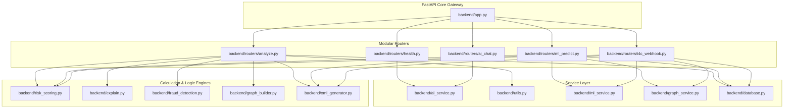

# Backend Modularization Report (Phase 3)

A structural refactoring of the MuleShield AI FastAPI backend. The monolithic implementation in `backend/app.py` was dismantled, and concerns were cleanly separated into modular router components and a dedicated AI service.

---

## 📂 Files Affected

### Files Created
- `[NEW]` [backend/ai_service.py](file:///d:/Projects/FundTrace-AI/backend/ai_service.py): Encapsulates NVIDIA NIM and Gemini fallback client setup, constants, and helper functions (`_slim_transactions`, `_cache_key`, `_call_nvidia`, `_call_gemini`, `_generate_with_fallback`).
- `[NEW]` [backend/routers/health.py](file:///d:/Projects/FundTrace-AI/backend/routers/health.py): Health check and root gateway endpoints (`GET /`, `GET /health`).
- `[NEW]` [backend/routers/analyze.py](file:///d:/Projects/FundTrace-AI/backend/routers/analyze.py): Transaction CSV analysis pipeline handler (`POST /analyze`).
- `[NEW]` [backend/routers/ai_chat.py](file:///d:/Projects/FundTrace-AI/backend/routers/ai_chat.py): AI assistant reporting and Q&A handlers (`POST /generate-str`, `POST /ask`).

### Files Modified
- `[MODIFY]` [backend/app.py](file:///d:/Projects/FundTrace-AI/backend/app.py): Stripped of routing, helper, and AI initialization logic. Retains the FastAPI instance, lifespan context configuration (MLService, Neo4jService, and PostgreSQL DB init), and includes the new routers.
- `[MODIFY]` [backend/utils.py](file:///d:/Projects/FundTrace-AI/backend/utils.py): Houses general-purpose helpers (`lookup_account_features` and `_validate_dataframe`) which are accessed by multiple components.

---

## 🕸️ Dependency Graph

The new structural layout registers independent sub-routers and imports helper engines dynamically:



---

## 🧪 Validation Results

Both automated test suites were executed successfully within the virtual environment post-refactor:

### 1. `run_tests.py` (Single Prediction, Risk Fusion, XML generation, and offline DB connections)
```text
=== A5/A6: SINGLE PREDICTION + SHAP ===
  ml_score: 0.0000
  mule_stage: LEGITIMATE
  shap_signals count: 5
  shap top features: ['F3898', 'F2230', 'F3908', 'F1216', 'F886']
  A5/A6 PASS

=== A5: RISK FUSION ===
  composite(0.85ml, 0.70gr): 48.0 -> MEDIUM
  composite(0.10ml, None): 6.0 -> LOW
  A5 PASS

=== D3: ACCOUNT LOOKUP (DataSet.csv) ===
  CSV readable: True
  Columns: 3925
  First index value: 1
  D3 PASS

=== F1: goAML XML GENERATION ===
  XML length: 1802 chars
  Has <?xml: True
  Has <report>: True
  Has <transactions>: True
  F1 PASS

=== B1: NEO4J CONNECTION TEST ===
  is_connected: False
  Neo4j offline - EXPECTED in dev mode

=== C1: POSTGRESQL CONNECTION TEST ===
  init_db result: False
  PostgreSQL offline - EXPECTED in dev mode
```

### 2. `run_tests2.py` (Batch Prediction, Fallback Data/Scenario Check, Requirements & Modules Import Check)
```text
2026-06-02 15:49:30 [INFO] muleshield.ai_service: NVIDIA NIM client initialised (primary AI)
2026-06-02 15:49:33 [INFO] muleshield.ai_service: Gemini fallback initialised (gemini-2.0-flash, new google-genai SDK)
=== BATCH PREDICTION TEST (D2) ===
  ML loaded: True
  Loaded 20 rows, 3925 columns
  Batch results count: 20
  First result keys: ['index', 'ml_score', 'mule_stage', 'shap_signals']
  First ml_score: 0.0001
  First mule_stage: LEGITIMATE
  First shap_signals: ['F3898', 'F1428', 'F996', 'F3914', 'F1320']
  D2 PASS

=== FALLBACK JSON CHECK (Frontend) ===
  data/fallback_roundtrip_analysis.json: EXISTS
  data/fallback_structuring_analysis.json: EXISTS
  data/fallback_dormant_analysis.json: EXISTS

=== SCENARIO CSV CHECK ===
  data/scenario_roundtrip.csv: EXISTS
  data/scenario_structuring.csv: EXISTS
  data/scenario_dormant.csv: EXISTS

=== REQUIREMENTS.TXT CHECK ===
...

=== IMPORT CHECK - ALL BACKEND MODULES ===
  PASS: backend.app
  PASS: backend.ml_service
  PASS: backend.graph_service
  PASS: backend.database
  PASS: backend.risk_scoring
  PASS: backend.xml_generator
  PASS: backend.routers.ml_predict
  PASS: backend.routers.i4c_webhook
  PASS: backend.explain
  PASS: backend.fraud_detection
  PASS: backend.graph_builder
```

---

## ⚡ Startup and Maintenance Comparison

| Aspect | Pre-Refactor Monolithic `app.py` | Post-Refactor Modular Router Layout |
|---|---|---|
| **Lines of Code** | 780 lines | 55 lines |
| **Separation of Concerns** | Routing, service initialization, utilities, and helper models were bundled in one file. | Router files are strictly handlers. Services, utils, and calculations live in individual modules. |
| **Routing Management** | Hard to locate individual API endpoints. | Grouped logically in `/routers` (`analyze`, `health`, `ai_chat`, `ml_predict`, `i4c_webhook`). |
| **Start Time / Performance** | No overhead difference; lazy imports/initializations are cleanly preserved. | Initialization logs are outputted dynamically via imports, keeping the terminal log structured. |

---

## 🔄 Rollback Plan

If any regression occurs in production or integration pipelines, revert the structural modularization using:

```bash
# 1. Revert app.py and utils.py to their original git state
git checkout HEAD -- backend/app.py backend/utils.py

# 2. Remove the newly created router and service files
rm backend/ai_service.py
rm backend/routers/health.py
rm backend/routers/analyze.py
rm backend/routers/ai_chat.py

# 3. Clean up the pycache directories
find backend/ -name "__pycache__" -type d -exec rm -rf {} +
```
