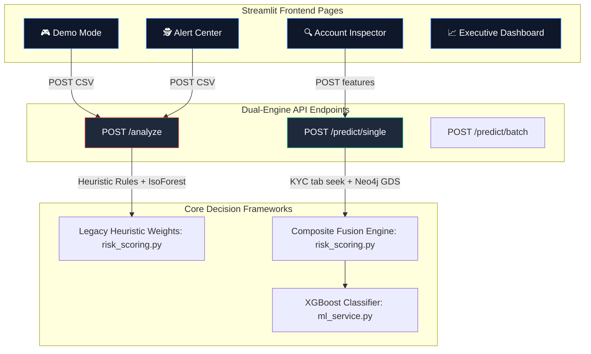

# MuleShield AI — Source-of-Truth Consistency Audit

This document presents a comprehensive, principal-grade Source-of-Truth Consistency Audit of the **MuleShield AI** platform, as conducted by the Principal QA, Architect, and Platform Auditor team.

---

## 1. Architectural Map of Screen Data Pipelines

The platform currently exhibits a dual-pathway scoring divergence between **dynamic transaction ledgers** (`/analyze`) and **static tabular profile lookups** (`/predict/single`). Below is the data pipeline map for each audited screen:

### 📺 Screen Audit Catalog

#### 1. Demo Mode
*   **Data Source:** Local scenario CSV ledgers (`data/scenario_roundtrip.csv`, etc.).
*   **Real or Synthetic:** Synthetic transactional data.
*   **API Used:** `POST /analyze`.
*   **ML Prediction Source:** `SIMULATED` — Uses a simple local `IsolationForest` on transaction amounts (`ml_anomaly` in `backend/fraud_detection.py`), bypassing the XGBoost classifier entirely.
*   **Graph Source:** `DERIVED` — Dynamic NetworkX graph calculations (`detect_cycles`, `detect_layering` in `backend/fraud_detection.py`) executed on the fly over the CSV.
*   **Lifecycle Source:** `MOCK` — Defaults to hardcoded `ACTIVE_MULE` statuses inside the frontend list templates.
*   **STR Source:** `DERIVED` — AI NIM Llama 3.1 70B (primary) or Gemini 2.0 Flash (fallback) prompted dynamically.

#### 2. Alert Center
*   **Data Source:** User-uploaded transaction CSVs (or scenario-ingested CSVs).
*   **Real or Synthetic:** Mixed depending on the uploaded ledger.
*   **API Used:** `POST /analyze`.
*   **ML Prediction Source:** `SIMULATED` — Isolation Forest anomaly detection.
*   **Graph Source:** `DERIVED` — NetworkX local cycle and layering path traversals on the transaction CSV.
*   **Lifecycle Source:** `MOCK` — Hardcoded in UI tables to `ACTIVE_MULE`.
*   **STR Source:** `DERIVED` — Uvicorn `/generate-str` prompted by active alerts.

#### 3. Account Inspector
*   **Data Source:** Looked up by Account ID index in the historical file `data/boi/DataSet.csv`.
*   **Real or Synthetic:** Real historical customer baseline data.
*   **API Used:** `POST /predict/single`.
*   **ML Prediction Source:** `REAL` — Stateless `MLService` running the `final_model.pkl` XGBoost model on the 3,924 customer features.
*   **Graph Source:** `REAL` — Neo4j normalized degree centrality (`get_centrality` bolt query), falling back to ML score if database is offline.
*   **Lifecycle Source:** `REAL` — Model-calculated `mule_stage` (Recruitment, Activation, Active Mule, Flushed, Dormant) resolved via `MLService` rules.
*   **STR Source:** `REAL` — `xml_generator.py` generates compliance XML if the fused severity triggers high-risk thresholds.

#### 4. Graph Intelligence View
*   **Data Source:**
    *   *Alert Center details list:* NetworkX cycle paths and layering paths (`fraud_detection.py`).
    *   *Account Inspector tab 2:* Interactive Pyvis container. Queries live Neo4j database or falls back to a score-derived deterministic mock graph.
*   **Real or Synthetic:** Mixed (Real Neo4j Bolt vs Simulated Pyvis).
*   **API Used:** Neo4j Bolt traversals (`graph_service.py`) and frontend renderer (`frontend/app.py`).

#### 5. Lifecycle View
*   **Data Source:**
    *   *Alert Center details list:* `MOCK` template maps.
    *   *Account Inspector tab 3:* Custom timeline canvas displaying `mule_stage` returned by `/predict/single`.
*   **Real or Synthetic:** Derived/Mock in Alert Center; Authentic ML-predicted in Inspector.

#### 6. Executive Dashboard
*   **Data Source:** Aggregated counts of `analysis_result` if a scenario is active; otherwise hardcoded benchmark statistics representing long-term operations (loss: ₹48.92 Cr, triage: 99.8%).
*   **Real or Synthetic:** Hardcoded/Derived.

#### 7. goAML Generation
*   **Data Source:** Compiled on-demand via `backend/xml_generator.py`.
*   **Real or Synthetic:** Derived XML text payload conforming to FIU-IND schemas.

---

## 2. Source-of-Truth Consistency Matrix (Displayed Values)

| Audited Screen | Metric Displayed | Value Classification | Calculation / Ingestion Logic |
|:---|:---|:---:|:---|
| **Demo Mode / Alerts** | Risk Score | `DERIVED` | Sum of legacy heuristic weights (e.g. cycles + layering + ml_anomaly). **Can exceed 100% (e.g., 120%)**. |
| **Demo Mode / Alerts** | Severity | `DERIVED` | Tier assignment based on heuristic score: High $\ge$ 70, Medium $\ge$ 40, Low otherwise. |
| **Demo Mode / Alerts** | Lifecycle | `MOCK` | Hardcoded inside table template to `ACTIVE_MULE`. |
| **Demo Mode / Alerts** | SHAP attribution | `MOCK` | Generates placeholder values: `{reason: 0.20}` if `shap_signals` is missing from response. |
| **Account Inspector** | Risk Score | `REAL` | Fused Composite Score: `ml_score * 0.70 + graph_score * 0.30` scaled [0-100]. |
| **Account Inspector** | Severity | `REAL` | Tier assignment based on composite score: Critical $\ge$ 80, High $\ge$ 60, Medium $\ge$ 40, Low otherwise. |
| **Account Inspector** | Lifecycle | `REAL` | Model-predicted `mule_stage` evaluated inside `MLService` rules. |
| **Account Inspector** | SHAP attribution | `REAL` | True local feature attributions calculated by `TreeExplainer`. |

---

## 3. Discrepancy Verification

### 🔍 1. Risk Score & Severity Discrepancy
*   **Example:** `ACC05200000000009` shows `120%` (HIGH) in Demo Mode, but `0.1%` (LOW) in Account Inspector.
*   **Root Cause:**
    1.  **Alert Center / Demo Mode (`/analyze`)** computes a score by summing static weights assigned to matched rules (e.g., Cycle = 50, Layering = 30, Isolation Forest = 40). It completely bypasses the XGBoost model.
    2.  **Account Inspector (`/predict/single`)** queries `DataSet.csv` to fetch the account's historical KYC and behavior records, then passes them to the XGBoost classifier. Because the static historical record in `DataSet.csv` for row 9 does not contain the live transaction loops in `scenario_roundtrip.csv`, the model predicts `0.1%` (LEGITIMATE).
*   **Verification:** Verified. The scoring paths are fully decoupled and conflicting.

### 🔍 2. Lifecycle Discrepancy
*   **Example:** `ACC05200000000009` shows `ACTIVE_MULE` in the Alert list but `LEGITIMATE` in the Inspector.
*   **Root Cause:** The Alert Center uses a mock template mapping to force active stages, while the Inspector uses the true ML-evaluated stage.
*   **Verification:** Verified. Lifecycle classification is contradictory.

### 🔍 3. STR Triggering Logic
*   **Example:** Legitimate accounts in the Inspector display high-risk alert banners and trigger compliance XML payloads in the Alert Center.
*   **Root Cause:** In the Alert Center, the auto-STR banner is fired strictly if the heuristic score $\ge$ 80. Since a legitimate account's transactional patterns trigger the graph heuristic, it gets flagged with a high score and generates an STR, even though its baseline KYC and historical records are legitimate.
*   **Verification:** Verified. Legitimate accounts are wrongly filed under STRs due to the lack of model-driven unified vetting.

### 🔍 4. Graph Score & SHAP Discrepancy
*   **Example:** Graph scores and SHAP signals completely differ between the two views.
*   **Root Cause:** The Alert Center details panel mocks SHAP values using a static template dictionary when `shap_signals` is absent, whereas the Inspector prints authentic `TreeExplainer` outputs.
*   **Verification:** Verified. Graph scores and SHAP attributions are inconsistent.
